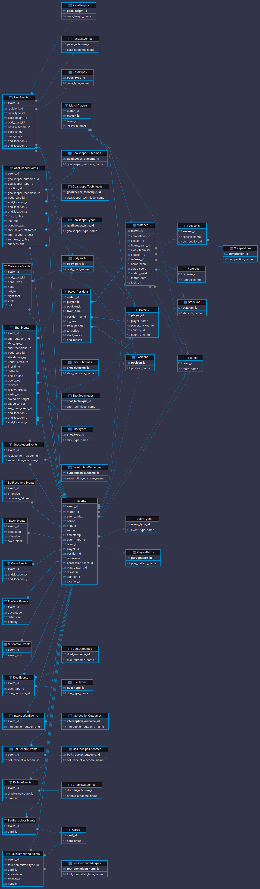
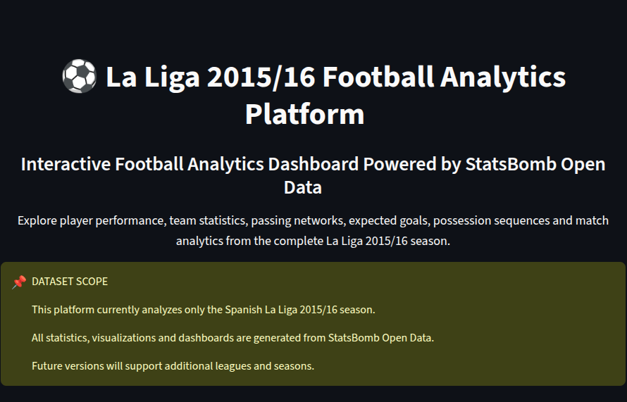
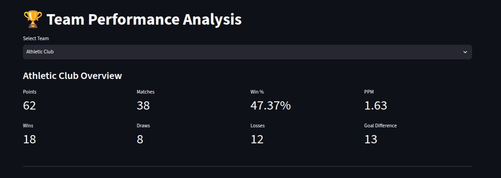
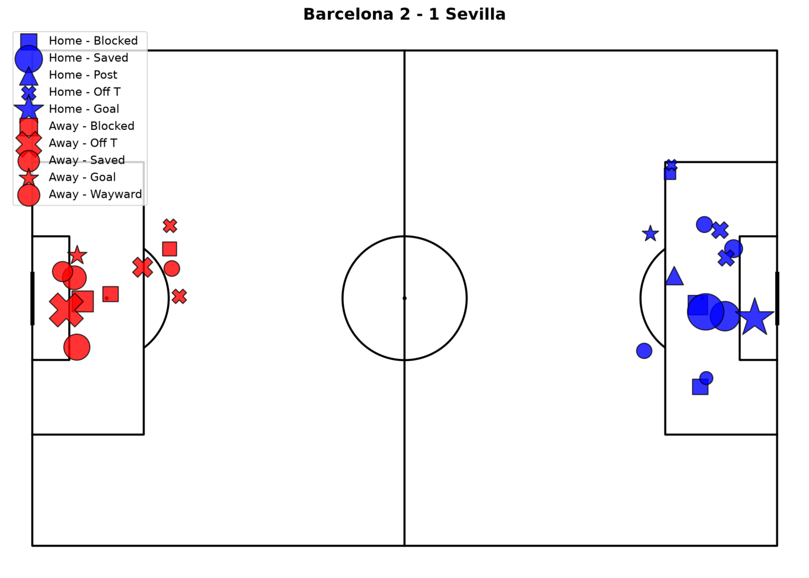
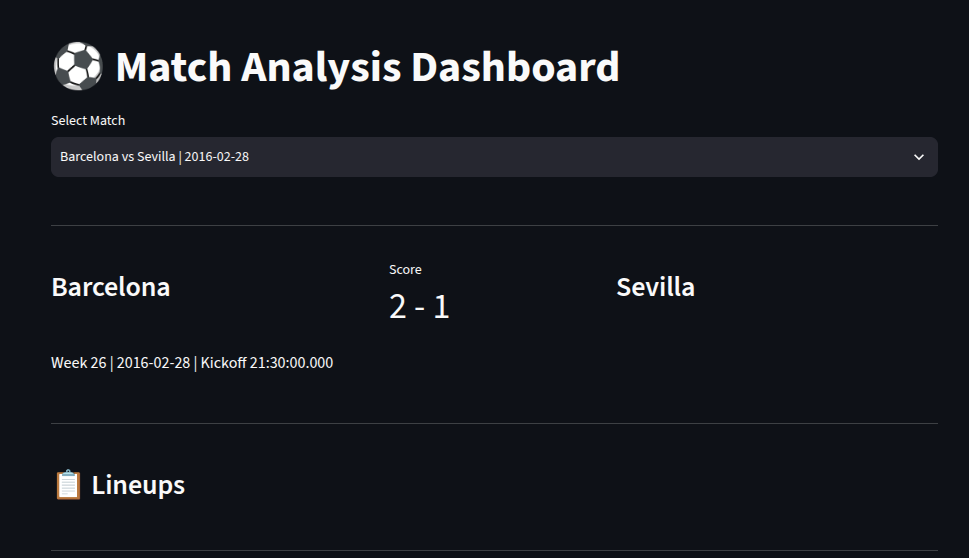
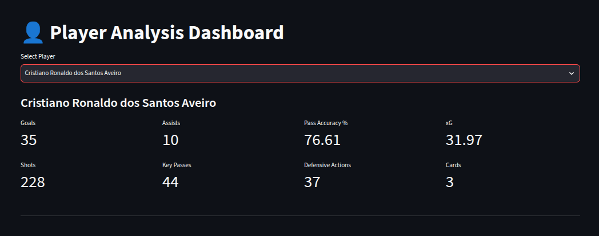
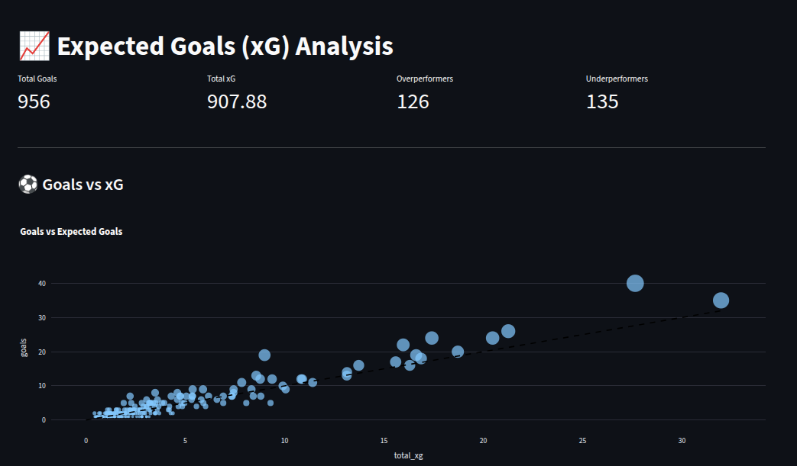
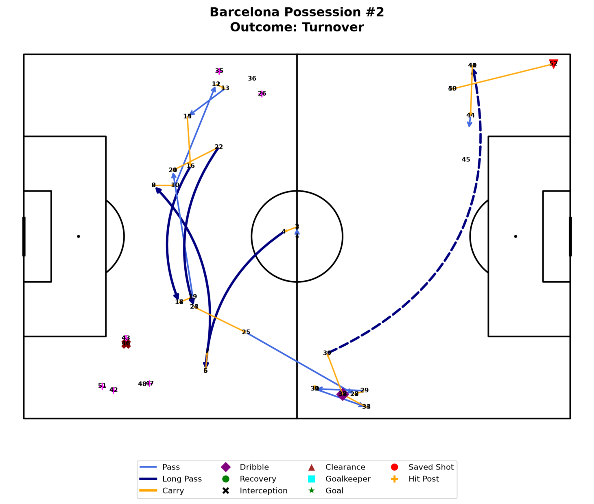

# ⚽ Football Analytics Dashboard

A professional football analytics platform built using **Python, SQLite, Streamlit, Pandas, and StatsBomb Open Data**.

This project transforms raw football event data into interactive visualizations and analytics dashboards, enabling match, player, team, and possession-level analysis.

---

## 🚀 Features

### 📊 Match Analysis
- Match summary
- Event timeline
- Team lineups
- Cards and substitutions
- Goalkeeper actions

### 🎯 Shot Analysis
- Interactive shot maps
- Real football pitch visualization
- Shot outcomes
- xG (Expected Goals)
- Team shot comparison

### 🔥 Player Analysis
- Player heatmaps
- Touch location analysis
- Player activity visualization

### 🕸 Pass Network Analysis
- Team passing network
- Passing connections between players
- Pass volume visualization

### ⚽ xG Analysis
- Team xG comparison
- Match xG breakdown
- Shot quality assessment

### 🔄 Possession Explorer
- Full possession visualization
- Event-by-event sequence analysis
- Passes, carries, dribbles and shots
- Possession outcomes
- Attacking direction normalization

---

## 🛠 Tech Stack

### Programming
- Python

### Data Analysis
- Pandas
- NumPy

### Database
- SQLite

### Visualization
- Matplotlib
- mplsoccer

### Dashboard
- Streamlit

### Data Source
- StatsBomb Open Data

---

## 📂 Project Structure

```text
football-analytics/

├── dashboard/
│   ├── Home.py
│   └── pages/
|            ├── 1_team_analysis.py
|            ├── 2_player_analysis.py
|            ├── 3_player_comparison.py
|            ├── 4_team_comparison.py
|            ├── 5_player_radar.py
|            ├── 6_match_analysis.py
|            ├── 7_player_heatmap.py
|            ├── 8_xG_analysis.py
|            ├── 10_possesion_explorer.py
|            └── 9_pass_network.py
|
│       
│
├── LICENSE
├── notebooks
├── README.md
├── reports
│   ├── charts
│   │   └── messi_radar.png
|
├── requirements.txt
├── sql
│   ├── match_analysis.sql
│   ├── player_analysis
│   │   ├── goalkeeper_analysis.sql
│   │   ├── player_attacking_analysis.sql
│   │   ├── player_creative_analysis.sql
│   │   ├── player_defensive_analysis.sql
│   │   ├── player_discipline_analysis.sql
│   │   ├── player_passing_analysis.sql
│   │   ├── player_shots_analysis.sql
│   │   └── player_xG.sql
│   ├── season_overview
│   │   ├── competition_summary.sql
│   │   ├── discipline.sql
│   │   ├── goal_statistics.sql
│   │   ├── match_competetivenss.sql
│   │   ├── match_intensity.sql
│   │   └── set_pieces.sql
│   └── team_analysis
│       ├── attacking_stats.sql
│       ├── defencive_stats.sql
│       ├── discipline.sql
│       ├── home_vs_away_perfomance.sql
│       ├── overall_perfomance.sql
│       ├── passing_perfomance.sql
│       ├── possesion_perfomance.sql
│       └── set_piece.sql
├── src
│   ├── analysis
│   │   ├── database_overview.sql
│   │   ├── events_suquence.py
│   │   ├── export_match_analysis.py
│   │   ├── heatmap_extraction.py
│   │   ├── __init__.py
│   │   ├── pass_network_export.py
│   │   ├── player_comparison.py
│   │   ├── player_master.py
│   │   ├── player_position_extraction.py
│   │   ├── player_radar_dataset.py
│   │   └── players_comparison_dataset.py
│   ├── config.py
│   ├── database
│   │   ├── __init__.py
│   │   ├── __pycache__
│   │   │   ├── __init__.cpython-312.pyc
│   │   │   └── schema.cpython-312.pyc
│   │   └── schema.py
│   ├── download.py
│   ├── etl
│   │   ├── extract.py
│   │   ├── __init__.py
│   │   ├── load.py
│   │   ├── __pycache__
│   │   │   ├── extract.cpython-312.pyc
│   │   │   ├── __init__.cpython-312.pyc
│   │   │   ├── load.cpython-312.pyc
│   │   │   └── transform.cpython-312.pyc
│   │   └── transform
│   │       ├── bad_behaviour.py
│   │       ├── ball_reciept.py
│   │       ├── ball_recovery.py
│   │       ├── block.py
│   │       ├── carry.py
│   │       ├── clearance.py
│   │       ├── dribble.py
│   │       ├── duels.py
│   │       ├── events.py
│   │       ├── foul_committed.py
│   │       ├── goalkeepers.py
│   │       ├── __init__.py
│   │       ├── interception.py
│   │       ├── lineups.py
│   │       ├── matches.py
│   │       ├── miscontrol.py
│   │       ├── passes.py
│   │       ├── __pycache__
│   │       │   ├── bad_behaviour.cpython-312.pyc
│   │       │   ├── ball_reciept.cpython-312.pyc
│   │       │   ├── ball_recovery.cpython-312.pyc
│   │       │   ├── block.cpython-312.pyc
│   │       │   ├── carry.cpython-312.pyc
│   │       │   ├── clearance.cpython-312.pyc
│   │       │   ├── dribble.cpython-312.pyc
│   │       │   ├── duels.cpython-312.pyc
│   │       │   ├── events.cpython-312.pyc
│   │       │   ├── foul_committed.cpython-312.pyc
│   │       │   ├── goalkeepers.cpython-312.pyc
│   │       │   ├── __init__.cpython-312.pyc
│   │       │   ├── interception.cpython-312.pyc
│   │       │   ├── lineups.cpython-312.pyc
│   │       │   ├── matches.cpython-312.pyc
│   │       │   ├── miscontrol.cpython-312.pyc
│   │       │   ├── others.cpython-312.pyc
│   │       │   ├── passes.cpython-312.pyc
│   │       │   ├── shots.cpython-312.pyc
│   │       │   └── substution.cpython-312.pyc
│   │       ├── shots.py
│   │       └── substution.py
│   ├── export_team_csv.py
│   ├── inspect_database.py
│   ├── main.py
│   ├── __pycache__
│   │   └── config.cpython-312.pyc
│   ├── utils
│   │   └── __init__.py
│   └── visualization
│       ├── __init__.py
│       ├── radar_chart.py
│       └── team_visulaiization.py
```

---

## 📈 Dashboard Pages

| File | Dashboard | Description |
|--------|--------|-------------|
| `1_team_analysis.py` | Team Analysis | Team performance overview and season statistics |
| `2_player_analysis.py` | Player Analysis | Individual player statistics and performance metrics |
| `3_player_comparison.py` | Player Comparison | Compare two players side-by-side |
| `4_team_comparison.py` | Team Comparison | Compare two teams across key metrics |
| `5_player_radar.py` | Player Radar | Radar chart analysis of player attributes |
| `6_match_analysis.py` | Match Analysis | Match statistics, timeline, and event breakdown |
| `7_player_heatmap.py` | Player Heatmap | Positional activity and heatmap visualization |
| `8_xG_analysis.py` | xG Analysis | Expected goals and shot quality analysis |
| `9_pass_network.py` | Pass Network | Team passing structure and passing relationships |
| `10_possesion_explorer.py` | Possession Explorer | Interactive possession sequence visualization |

---
## 🏗 Architecture

<p align="center">
  
</p>

## 📊 Analytics Pipeline

```text
StatsBomb Open Data
            │
            ▼
      JSON Files
            │
            ▼
      SQLite Database
            │
            ▼
    Data Processing Scripts
            │
            ▼
      Analytics CSV Layer
            │
            ▼
    Streamlit Dashboard
            │
            ▼
      Football Insights
```

---

## ⚽ Data Source

This project uses the official StatsBomb Open Data repository.

StatsBomb provides detailed football event data including:

- Matches
- Events
- Lineups
- Shots
- Passes
- Possessions
- Player actions

Repository:

https://github.com/statsbomb/open-data

---

## ER Diagram

<p align="center">
  
</p>

## 📸 Screenshots
# Dashboard Screenshots

## Home Page

<p align="center">
  
</p>

## Team Analysis

<p align="center">
  
</p>

## Shot Map

<p align="center">
  
</p>

## Match Analysis

<p align="center">
  
</p>


## Player Analysis

<p align="center">
  
</p>

## xG Analysis

<p align="center">
  
</p>

## Possession Explorer

<p align="center">
  
</p>

## ⚙️ Installation

Clone the repository:

```bash
git clone https://github.com/vishnu8406/football-analytics.git

cd football-analytics
```

Install dependencies:

```bash
pip install -r requirements.txt
```

Run the dashboard:

```bash
streamlit run dashboard/Home.py
```

---

## 🌐 Deployment

The dashboard can be deployed using:

- Streamlit Community Cloud
- Render
- Railway

Recommended:

Streamlit Community Cloud

---
## 🌐 Live Demo

🚀 Dashboard:
https://football-analytics-maiyarasu.streamlit.app/

📂 GitHub Repository:
https://github.com/vishnu8406/football-analytics

## 🤗 Dataset Availability

The processed SQLite database used by this project is publicly available.

### Contents

- football.db
- 47 relational tables
- Match data
- Event data
- Player data
- Team data
- Shot events
- Pass events
- Possession events
- Goalkeeper events

### Download

Hugging Face Dataset:

https://huggingface.co/datasets/Maiyarasu/football_analytics

The dataset is generated using the ETL pipeline included in this repository.
## 🎯 Project Objectives

The goal of this project is to demonstrate:

- Data Engineering
- Database Design
- ETL Pipelines
- Data Analysis
- Sports Analytics
- Dashboard Development
- Data Visualization

through a complete end-to-end football analytics workflow.

---

## 🔮 Future Enhancements

### Version 2

- Team Dashboard
- Goal Build-Up Analysis
- Progressive Pass Analysis
- Final Third Entries
- Turnover Analysis
- Passing Lanes
- Player Comparison Dashboard
- Team Comparison Dashboard
- Season Analytics

---

## 👨‍💻 Author

**Vishnu / S. Maiyarasu**

Electrical & Electronics Engineering  
Data Analytics Enthusiast  
Python Developer  
Football Analytics Explorer

---

## ⭐ Acknowledgements

- StatsBomb Open Data
- Streamlit
- mplsoccer
- Pandas Community
- Python Open Source Ecosystem

---

If you found this project useful, consider giving it a ⭐ on GitHub.

## 📄 License

This project is licensed under the MIT License.# football-analytics
